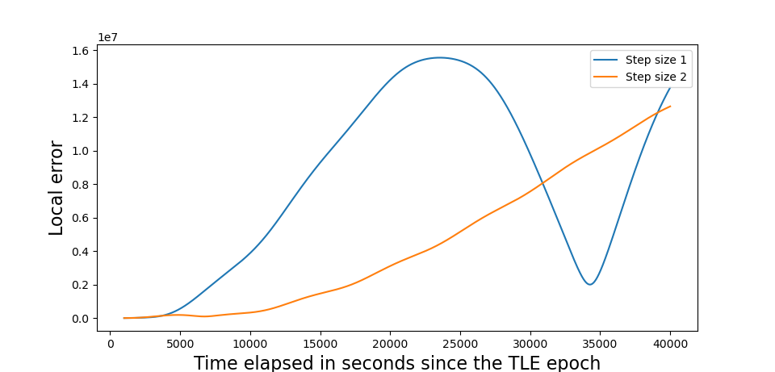
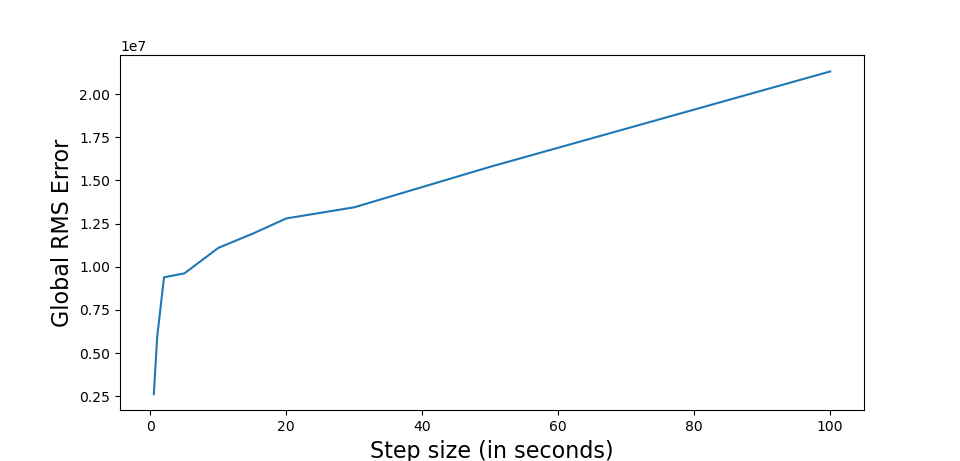
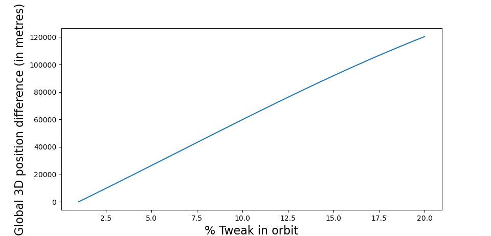
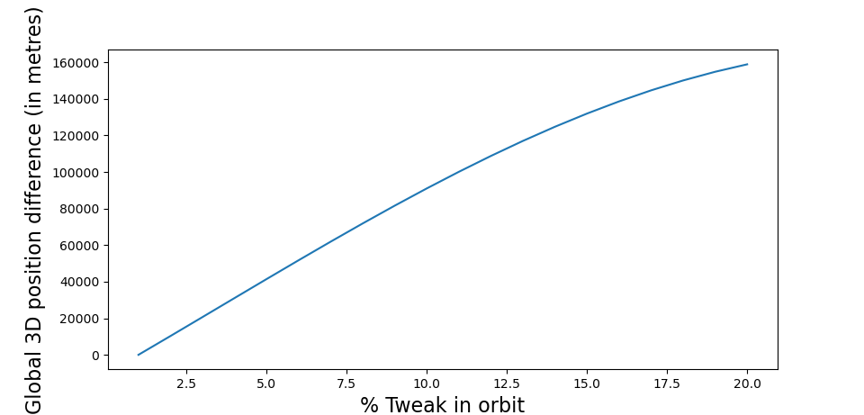
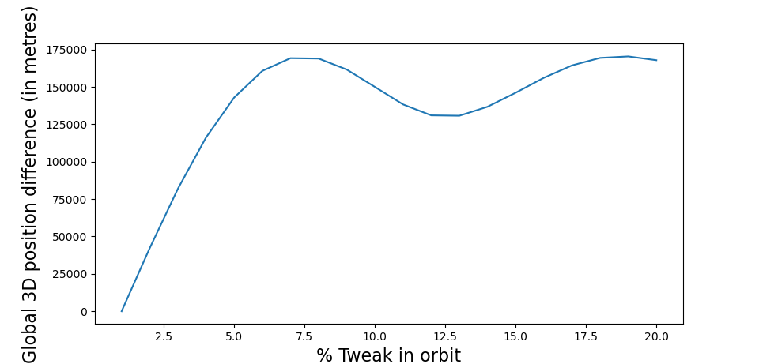
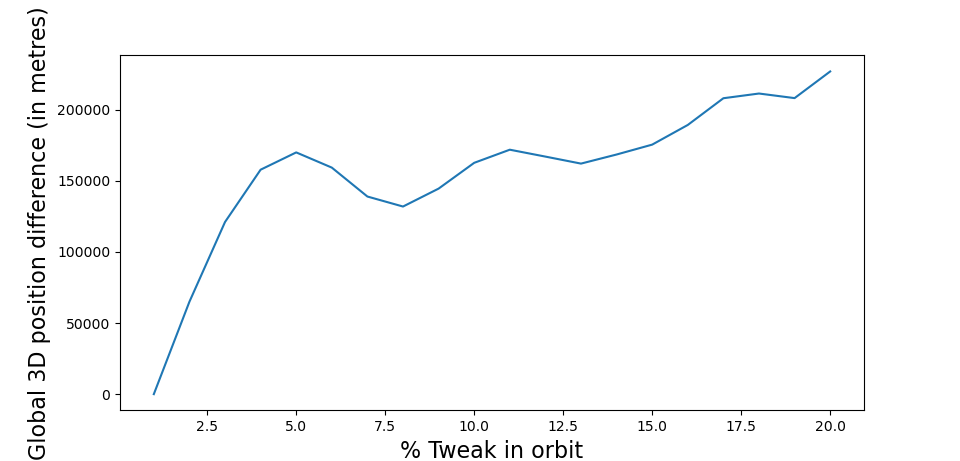
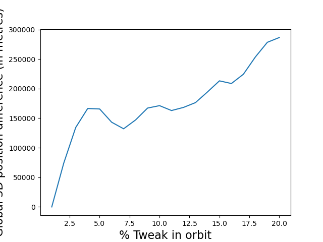
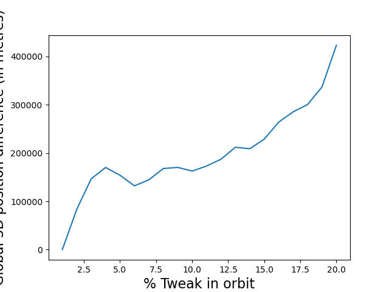

# Introduction

Please carefully read the [rules](rules/README.md), they may have changed or been clarified. Refer to the [assignment text](README.md) before doing the tasks described in this document. Don't forget to copy this file to `report.md` and filling your answers there. Do not edit this file.

In the answers below, report the data points with the following the order and units of their components:

- for Cartesian coordinates
    1. time [s since TLE epoch]
    2. position x [m]
    3. position y [m]
    4. position z [m]
    5. velocity x [m]
    6. velocity y [m]
    7. velocity z [m]

# 1 Update your orbit

Report the TLE data you retrieved. If you retrieved TLE data in `KVN`, `XML`, `JSON` or `CSV` formats, report it in `TLE` format.

~~~
CRYOSAT 2               
1 36508U 10013A   22343.58574940  .00000154  00000+0  37545-4 0  9990
2 36508  92.0234 326.5313 0005494  37.6133 322.5457 14.51903075671582
~~~

Report the start time of your time domain, in terms of seconds since the epoch of your TLE data.

1000

Report the stop time of your time domain, in terms of seconds since the epoch of your TLE data.

39995

Report the time step in your time domain, in terms of seconds.

5

Report the first data point from the SGP4 orbit.

1.000000000000000000e+03 -2.746290534208040684e+06 2.088953640659041470e+06 -6.214870079971263185e+06 5.519641094390514809e+03 -3.514813625996715018e+03 -3.619958864992235249e+03

Report the last data point from the SGP4 orbit.

3.999500000000000000e+04 1.042111226361509180e+06 -9.839753523379525868e+05 6.940972622143341228e+06 -6.156844876966411903e+03 4.011668451814641230e+03 1.492906857185614854e+03

# 2 Implement an Euler integrator

Report the code that implements the function that computes the 3D gravitational acceleration resulting from a point mass as function of position.

~~~
def acc_calc(r):
#Function to calculate acceleration vector and magnitude
    
    r_mag=sqrt((r[0]**2)+(r[1]**2)+(r[2]**2))
    acc=-G*M*r/(r_mag**3)
    
    return acc
~~~

Report the code that implements the Euler integrator, i.e., the part of your code that is doing the Euler integration.

~~~
def euler_int(filename, start, stop, step):
#Function to carry out integration using the Euler's method
    
    sgp4_data=np.loadtxt(filename, dtype=float)
    
    dim=np.shape(sgp4_data)
    count=dim[0]
    
    time_elpased, r, r_mag, v, acc, y, y_dot, diff_1, diff_2, local_err_1, local_err_2, local_t_start, local_t_end = declare(count)
    
    time_elpased[0]=start

    x_init=sgp4_data[0,1]
    y_init=sgp4_data[0,2]
    z_init=sgp4_data[0,3]
    
    r[:,0]=[x_init,y_init,z_init]
    r_mag[0]=sqrt((x_init**2)+(y_init**2)+(z_init**2))
    #Initial position vector from sgp4 model
    
    x_dot_init=sgp4_data[0,4]
    y_dot_init=sgp4_data[0,5]
    z_dot_init=sgp4_data[0,6]
    v[:,0]=[x_dot_init,y_dot_init,z_dot_init]
    #Initial velocity vector from sgp4 model
    
    acc[:,0]=-G*M*r[:,0]/(r_mag[0]**3)
    #Initial acceleration vector
    
    y[:,0]=np.hstack([r[:,0],v[:,0]])
    y_dot[:,0]=np.hstack([v[:,0],acc[:,0]])
    #Vectors used for iterations during integration
    
    begin=time.time()
    #Time value to be used for total time for integration
    
    diff_t=0
    #Variable to be used for storing average time per iteration
    
    for i in range(count-1):
        
        local_t_start[i]=time.time()
        #Variable to store start time of each iteration
        
        y[:,i+1]=y[:,i]+(step*y_dot[:,i])
      
        r[:,i+1]=[y[0,i+1],y[1,i+1],y[2,i+1]]
        r_mag[i+1]=sqrt((r[0,i+1]**2)+(r[1,i+1]**2)+(r[2,i+1]**2))
          
        v[:,i+1]=[y[3,i+1],y[4,i+1],y[5,i+1]]
          
        acc[:,i+1]=acc_calc(r[:,i+1])
          
        y_dot[:,i+1]=np.hstack([v[:,i+1],acc[:,i+1]])
          
        time_elpased[i+1]=time_elpased[i]+step
        
        local_t_end[i]=time.time()
        #Variable to store end time of each iteration
        
        diff_t=diff_t+local_t_end[i]-local_t_start[i]
        
    avg_t=diff_t/count
    end=time.time()
    
    output=np.column_stack((time_elpased,np.transpose(r),np.transpose(v)))    
    
    print('\n time_elpased per iteration: ',avg_t)
    print('\n Total time_elpased: ',end-begin)
    
    return output
~~~

Report the command that you use in the CLI to generate the integrated orbit.

python -c "import assignment2_code;assignment2_code.euler_int('out2.dat',1000,40000,5)"

Report the first data point from the integrated orbit.

1.000000000000000000e+03 -2.746290534208040684e+06 2.088953640659041470e+06 -6.214870079971263185e+06 5.519641094390514809e+03 -3.514813625996715018e+03 -3.619958864992235249e+03

Report the last data point from the integrated orbit.

3.999500000000000000e+04 6.408947323029709980e+06 -4.031963604177419562e+06 -5.361305890303825028e+06 3.056230542837383382e+03 -2.259949996511969857e+03 5.390231802598729701e+03

Report the time your integrator takes to produce the orbit.

0.15685725212097168

Report the the average computational time per integration step.

1.9597946069179437e-05

# 3 Assess the errors of your integrator

Report the markdown code that adds to this document your plot with the local error as function of time for two different step sizes.

Report the command that you use in the CLI to generate your plot.

>python -c "import assignment2_code;assignment2_code.local_error_calc('tle2.dat',1000,40000,5,1,'sgp4_size_5.dat','sgp4_size_1.dat')"

Report the markdown code that adds to this document your plot with the global error as function of different step sizes.

Report the command that you use in the CLI to generate your plot.

python -c "import assignment2_code;assignment2_code.global_error_calc('tle2.dat',1000,40000,[0.5,1,2,5,10,15,20,30,50,100],['sgp4_size_05.dat','sgp4_size_1.dat','sgp4_size_2.dat','sgp4_size_5.dat','sgp4_size_10.dat','sgp4_size_15.dat','sgp4_size_20.dat','sgp4_size_30.dat','sgp4_size_50.dat','sgp4_size_100.dat'],['euler_size_05.dat','euler_size_1.dat','euler_size_2.dat','euler_size_5.dat','euler_size_10.dat','euler_size_15.dat','euler_size_20.dat','euler_size_30.dat','euler_size_50.dat','euler_size_100.dat'])"

Make three observations on the local and/or global error plots.

1. The local error for both step sizes remains almost similar upto around 4000s since the TLE epoch after which the rate at which it increases for the bigger step size is significantly larger.
2. The local error for the bigger step size decreases below that of the smaller step size at around 31000s and seems to oscillate in value, while the local error for the smaller step size seems to montonically increase.
3. The global error monotonically increases with step size and has an initial sharp increase.

Make two interpretations about the observations you reported above.

1. The average local error for a small step size is smaller for a shorter time domain, while for a relatively longer time domain, the bigger step size provides a lower average error.
2. The global error is propotional to the step size, although the magnitude of proportionality (slope of the curve) varies for different range of step sizes.

Make one conclusion based on the observations and interpretations you reported above.

From observation 3 and interpretations 1 and 2, it can be concluded that it is beneficial to use larger step sizes for longer time domains if computational time is the most important factor. This follows from a relatively lower local error and a global error that does not increase very sharply.

# 4 Assess the stability of your integrator

Report the markdown code that adds to this document the plot showing the 3D position difference as function of time for small changes in the initial state vector of the sgp4 orbit.

Report the command that you use in the CLI to generate your plot.

python -c "import assignment2_code;assignment2_code.local_stability('out2.dat',[1,1,1,1,1,1])"

Report the markdown code that adds to this document the 6 plots showing the global 3D position difference as function of the tweaked initial state vector of the sgp4 orbit.

Report the command that you use in the CLI to generate your plot.

python -c "import assignment2_code;assignment2_code.global_stability('out2.dat',20)

Make three observations on the local and/or global stability plots.

1. The local 3D position difference monotonically increases for tweaks to all terms in the state vector and is slightly oscillatory.
2. The highest local difference in position occurs while tweaking the Z component of velocity while the least change occurs while tweaking the X-position.
3. The global 3D position difference variation for the velocity components monotonically increase upto a tweak value of around 4% after which the variation is irregular.

Make two interpretations about the observations you reported above.

1. The Z component of the state vector has a relatively bigger influence on the local difference in position.
2. The global difference in position is less predictable for larger deviation in velocity values from the original orbit.

Make one conclusion based on the observations and interpretations you reported above.

Observation 2 and interpretation 1 leads to the conclusion that the position vector of the satellite is nearly aligned with the Z-direction due to its large sensitivity to tweaks. 

# 5 Final remarks

Report the steps you have taken to address Code Excellence. Report "none" if relevant.

1. Used CLI commands in tasks 2.2, 3.2, 3.4, 4.2 and 4.4.
2. Performed unit testing for euler integration using the script "euler_int.py" and local error calculation using the script "error_calc.py".

Report the steps you have taken to address Assignment Excellence. Report "none" if relevant.

- Implement additional integrators and the ability to easily switch between them.

Attempted the use of Adams Bashforth method mentioned under function adams_bashforth() in the script "assignment2_code.py". The code however did not yield accurate results.

- Repeat Task 3 for one other integrator that you implemented in [Task 2](2-Implement-an-Euler-integrator). Derive observations, interpretations and conclusions on the differences between the two integrators.

None

- Repeat Task 4 for one other integrator that you implemented in [Task 2](2-Implement-an-Euler-integrator). Derive observations, interpretations and conclusions on the differences between the two integrators.

None

Report how long it took you to solve this assignment, in (fractional) hours.

14.5

Please provide any feedback on the assignment, for example, how it felt to work through it, if you found it to be too easy or difficult or if you learned new things or skills.

I learned quite a lot with respect to using numerical integrators from scratch which I did not know before. Less time consuming than the previous assignment, although more than the nominal/expected time of ~11 hours.