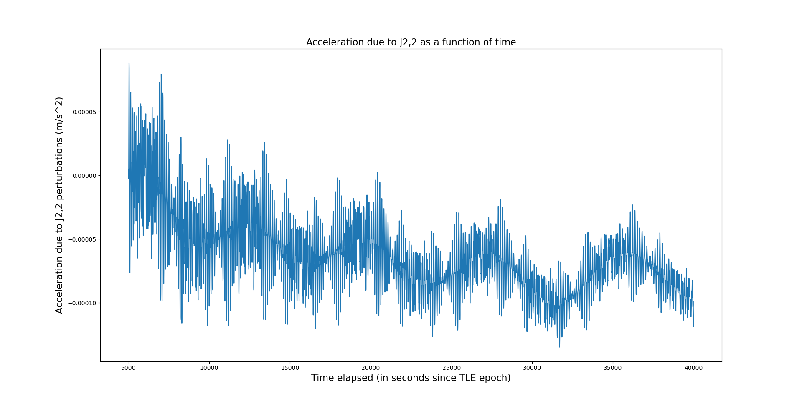

# Introduction

Please carefully read the [rules](rules/README.md), they may have changed or been clarified. Refer to the [assignment text](README.md) before doing the tasks described in this document. Don't forget to copy this file to `report.md` and filling your answers there. Do not edit this file.

In the answers below, report/plot the data points with the following the order and units of their components:

- for Cartesian coordinates
    1. time [s since TLE epoch]
    2. position x [m]
    3. position y [m]
    4. position z [m]
    5. velocity x [m]
    6. velocity y [m]
    7. velocity z [m]

- for Spherical coordinates:
    1. time [s]
    2. azimuth or longitude [deg] 
    3. elevation or latitude [deg]
    4. radius [m] (not altitude)
    5. azimuthal or latitudinal velocity [deg/s]
    6. elevational or longitudinal velocity [deg/s]
    7. radial velocity [m/s]

# 1 Update your orbit

Report the TLE data you retrieved. If you retrieved TLE data in `KVN`, `XML`, `JSON` or `CSV` formats, report it in `TLE` format.

~~~
CRYOSAT 2               
1 36508U 10013A   23003.60368422  .00000203  00000+0  49572-4 0  9991
2 36508  92.0258 332.5764 0002217 307.1243  52.9762 14.51904866675173
~~~

Report the start time of your time domain, in terms of seconds since the epoch of your TLE data.

5000

Report the stop time of your time domain, in terms of seconds since the epoch of your TLE data.

39995

Report the time step in your time domain, in terms of seconds.

5

Report the first data point from the SGP4 orbit, in Cartesian coordinates.

5.000000000000000000e+03 5.446440143445770256e+06 -2.979188976897136774e+06 3.437230248705434613e+06 -3.334681973100447976e+03 1.478918899626343546e+03 6.549173791137109220e+03

Report the last data point from the SGP4 orbit, in Cartesian coordinates.

3.999500000000000000e+04 6.106921991808374412e+06 -3.098360369454351254e+06 -1.879447120854632230e+06 1.638866597957396152e+03 -1.139297821701253724e+03 7.222056266197126206e+03

Report the first data point from the integrated orbit, in Cartesian coordinates.

5.000000000000000000e+03 5.446440143445770256e+06 -2.979188976897136774e+06 3.437230248705434613e+06 -3.334681973100447976e+03 1.478918899626343546e+03 6.549173791137109220e+03

Report the last data point from the integrated orbit, in Cartesian coordinates.

3.999500000000000000e+04 5.304557911745433696e+06 -2.480469018698483706e+06 -7.210689435433113016e+06 4.452065110736523820e+03 -2.485574762219105651e+03 4.071000469402465569e+03

# 2 Implement the gravitational disturbance resulting from Earth's oblateness

Report the code that computes the gravitational disturbance resulting from Earth's oblateness as function of Cartesian positions.

~~~
def acc_oblate(r):
#Function to calculate acceleration vector and magnitude with J2 perturbations
    
    r_mag=sqrt((r[0]**2)+(r[1]**2)+(r[2]**2))
    
    K1=(-3*mu*J2/2)*(R_e**2/r_mag**5)
    K2=r[2]**2/r_mag**2
    #Arbitrary constants to simplify final expression
    
    a_x=K1*r[0]*(1-(5*K2))
    a_y=K1*r[1]*(1-(5*K2))
    a_z=K1*r[2]*(3-(5*K2))
    
    acc=np.array([a_x,a_y,a_z])
    
    return acc
~~~

Report the command that you use in the CLI to generate the orbit under the influence of this disturbance.

python -c "import assignment3_code;assignment3_code.plot('out3.dat',1000,40000,5,0)"

Report true if you included the effect of $`J_{2,2}`$ to produce the disturbed orbit, in addition to the effect of $`J_2`$; answer false otherwise.

false

Report the first data point from the disturbed orbit, in Cartesian coordinates.

5.000000000000000000e+03 5.446440143445770256e+06 -2.979188976897136774e+06 3.437230248705434613e+06 -3.334681973100447976e+03 1.478918899626343546e+03 6.549173791137109220e+03

Report the last data point from the disturbed orbit, in Cartesian coordinates.

3.999500000000000000e+04 5.310896113184116781e+06 -2.476913312955637928e+06 -7.197751035682145506e+06 4.452102114586218704e+03 -2.479590550308617367e+03 4.078443825547420147e+03

Report the markdown code that adds to this document your plot with the radial, longitudinal and latitudinal difference between the disturbed orbit and the integrated orbit.

Report the markdown code that adds to this document your plot with the magnitude of the gravitational disturbance resulting from Earth's oblateness.

Report the command that you use in the CLI to generate your plots.

~~~
python -c "import assignment3_code;assignment3_code.plot('out3.dat',1000,40000,5,1)"
python -c "import assignment3_code;assignment3_code.plot('out3.dat',1000,40000,5,2)"
~~~

Make three observations on these plots.

~~~
1. The radial difference varies sinusoidally with varying amplitudes and a maximum amplitude of over 15km.
2. The difference in lattitude and longitude is low for most parts except for sharp peaks observed in the lattitude difference occuring at regular intervals that overlap with a change in sign of the longitude difference.
(Note the maximum difference in latitude of around 360 degrees is not within the range of the plot. The range was reduced so that the smaller peaks are clearly visible) 
3. The acceleration due to J2 varies sinusoidally consisting of two distinct components whose amplitudes gradually decrease over time.
~~~

Make two interpretations about the observations you reported above.

~~~
1. The interval of regular peaks of the lattitude difference has a corelation with the time period of the orbit since both values are very similar.
2. Based on the acceleration of the satellite due to J2 perturbations, its effect will be negligible after a large time interval and will be zero as time approaches infinity. This contradicts with the formulation of J2 which is independent of time.
~~~

Make one conclusion based on the observations and interpretations you reported above.

~~~
The J2 perturbations are not accurately predicted over time while integrating the orbit.
~~~

# 3 Implement the effect of drag

Report the code that computes the drag disturbance as function of Cartesian positions and velocities.

~~~
def acc_drag(r,v):
#Function to calculate acceleration vector and magnitude with perturbations due to atmospheric drag without a co-rotating atmposphere
    
    h=sqrt((r[0]**2)+(r[1]**2)+(r[2]**2))
    v_mag=sqrt((v[0]**2)+(v[1]**2)+(v[2]**2))
    rho=rho_0*exp(-h/H)
    a_d=np.array(int(-0.5*rho*B*v_mag)*v)
    
    return a_d
~~~

Report the command that you use in the CLI to generate the orbit under the influence of this disturbance.

python -c "import assignment3_code;assignment3_code.plot('out3.dat',1000,40000,5,0)"

Report true if you included the effect the rotating atmosphere of the Earth; answer false otherwise.

false

Report the first data point from the disturbed orbit, in Cartesian coordinates.

5.000000000000000000e+03 5.446440143445770256e+06 -2.979188976897136774e+06 3.437230248705434613e+06 -3.334681973100447976e+03 1.478918899626343546e+03 6.549173791137109220e+03

Report the last data point from the disturbed orbit, in Cartesian coordinates.

3.999500000000000000e+04 5.304557911745433696e+06 -2.480469018698483706e+06 -7.210689435433113016e+06 4.452065110736523820e+03 -2.485574762219105651e+03 4.071000469402465569e+03

Report the markdown code that adds to this document your plot with the radial, longitudinal and latitudinal difference between the disturbed orbit and the integrated orbit.

Report the markdown code that adds to this document your plot with the magnitude of the drag.

Report the command that you use in the CLI to generate your plots.

~~~
python -c "import assignment3_code;assignment3_code.plot('out3.dat',1000,40000,5,5)"
python -c "import assignment3_code;assignment3_code.plot('out3.dat',1000,40000,5,6)"
~~~

Make three observations on these plots.

~~~
1. There is no visible difference in position of the satellite in the radial direction.
2. No difference in latitude or longitude is clearly visible due to the perturbations.
3. Acceleration due to drag is constant over time and equal to zero.
~~~

Make two interpretations about the observations you reported above.

~~~
1. The effect of atmospheric drag on the motion of the satellite is either zero or smaller than the lower limit value that can be stored by the variable that is plotted.
2. The acceleration caused by the drag is negligible or smaller than the lower limit value that can be stored by the variable that is plotted.
~~~

Make one conclusion based on the observations and interpretations you reported above.

~~~
Based on the plots, it is inconclusive as to what the extent of the effect of drag on the satellite orbit would be. Variables with higher precision can be used for plots to obtain possible non-zero results.
~~~

# 4 Implement the effect of radiation pressure force

Report the code that computes the solar radiation pressure disturbance as function of Cartesian positions and velocities.

~~~
def acc_SRP(r_es,choice):
#Function to calculate acceleration vector and magnitude with perturbations due to solar radiation pressure

    r_ss=r_es-r_sun
    
    r_es_mag=sqrt((r_es[0]**2)+(r_es[1]**2)+(r_es[2]**2))
    r_ss_mag=sqrt((r_ss[0]**2)+(r_ss[1]**2)+(r_ss[2]**2))
    
    r_es_u=r_es/r_es_mag
    r_ss_u=r_ss/r_ss_mag
    
    r_ps=np.dot(r_ss_u,r_es)*r_ss_u
    r_ps_mag=sqrt((r_ps[0]**2)+(r_ps[1]**2)+(r_ps[2]**2))
    R_p=(r_ps_mag*R_sun)/r_ss_mag
    
    r_ep=r_es-r_ps
    r_ep_mag=sqrt((r_ep[0]**2)+(r_ep[1]**2)+(r_ep[2]**2))
    h_g=r_ep_mag-R_e
    
    shadow_func=h_g/R_p
    
    if(choice==6):
        acc=umbra(shadow_func,r_ss_u)
    
    elif(choice==7):
        acc=penumbra(shadow_func,r_ss_u)
        
    return acc

def umbra(shadow_func,r_ss_u):
#Function to calculate acceleration vector and magnitude with perturbations due to solar radiation pressure without considering the effect of penumbra

    if(shadow_func<1):
        a_srp=0
    
    elif(shadow_func>=1):
        a_srp=-(B_r*W/c)*r_ss_u
        
    return a_srp
~~~

Report the command that you use in the CLI to generate the orbit under the influence of this disturbance.

python -c "import assignment3_code;assignment3_code.plot('out3.dat',1000,40000,5,0)"

Report true if you included the effect the penumbra differently than the umbra; answer false otherwise.

false

Report the first data point from the disturbed orbit, in Cartesian coordinates.

5.000000000000000000e+03 5.446440143445770256e+06 -2.979188976897136774e+06 3.437230248705434613e+06 -3.334681973100447976e+03 1.478918899626343546e+03 6.549173791137109220e+03

Report the last data point from the disturbed orbit, in Cartesian coordinates.

3.999500000000000000e+04 5.304562401605647057e+06 -2.480471675444219727e+06 -7.210685513161477633e+06 4.452063710265582813e+03 -2.485574122847499893e+03 4.071002283467002144e+03

Report the markdown code that adds to this document your plot with the radial, longitudinal and latitudinal difference between the disturbed orbit and the integrated orbit.

Report the markdown code that adds to this document your plot with the magnitude of the radiation pressure force.

Report the command that you use in the CLI to generate your plots.

~~~
python -c "import assignment3_code;assignment3_code.plot('out3.dat',1000,40000,5,9)"
python -c "import assignment3_code;assignment3_code.plot('out3.dat',1000,40000,5,10)"
~~~

Make three observations on these plots.

~~~
1. The magnitude of radial difference increases sinusoidally with time.
2. The latitude and longitude difference do not vary significantly except at certain points in time that show sharp peaks in latitude difference with increasing amplitudes that coincide with a sign change of the longitude difference.
3. The acceleration due to solar radiation pressure varies sinusoidally with time with an increasing amplitude of the order 1e-6.
~~~

Make two interpretations about the observations you reported above.

~~~
1. The radius of the satellite's orbit increases with time in the presence of perturbations due to solar radiation pressure.
2. The order of magnitude of the perturbing acceleration is 1e+4 times smaller than that of J2 perturbations.
~~~

Make one conclusion based on the observations and interpretations you reported above.

~~~
The effect of solar radiation pressure on the motion of the satellite is negligible compared to that of J2.
~~~

# 5 Implement the effect of 3rd body perturbations

Report the code that computes the disturbance caused by the gravitational attraction of the Sun and the Moon, as function of Cartesian positions and velocities.

~~~
def acc_3BP(r,r_sun,r_moon):
#Function to calculate acceleration vector and magnitude with perturbations due to Sun and Moon
    
    r_mag=sqrt((r[0]**2)+(r[1]**2)+(r[2]**2))
    r_sun_mag=sqrt((r_sun[0]**2)+(r_sun[1]**2)+(r_sun[2]**2))
    r_moon_mag=sqrt((r_moon[0]**2)+(r_moon[1]**2)+(r_moon[2]**2))
    
    a_x_sun=mu_sun*(((r_sun[0]-r[0])/(r_sun_mag-r_mag)**3)-(r_sun[0]/r_sun_mag**3)) 
    a_y_sun=mu_sun*(((r_sun[1]-r[1])/(r_sun_mag-r_mag)**3)-(r_sun[1]/r_sun_mag**3))
    a_z_sun=mu_sun*(((r_sun[2]-r[2])/(r_sun_mag-r_mag)**3)-(r_sun[2]/r_sun_mag**3)) 
    
    a_x_moon=mu_moon*(((r_moon[0]-r[0])/(r_moon_mag-r_mag)**3)-(r_moon[0]/r_moon_mag**3))
    a_y_moon=mu_moon*(((r_moon[1]-r[1])/(r_moon_mag-r_mag)**3)-(r_moon[1]/r_moon_mag**3))
    a_z_moon=mu_moon*(((r_moon[2]-r[2])/(r_moon_mag-r_mag)**3)-(r_moon[2]/r_moon_mag**3))
    
    acc_sun=np.array([a_x_sun,a_y_sun,a_z_sun])
    acc_moon=np.array([a_x_moon,a_y_moon,a_z_moon])
    
    return acc_sun, acc_moon
    #Returning acceleration of Sun and Moon for separate plots
~~~

Report the command that you use in the CLI to generate the orbit under the influence of this disturbance.

python -c "import assignment3_code;assignment3_code.plot('out3.dat',5000,40000,5,0)"

Report true if you used the actual positions of the Sun and Moon; answer false otherwise.

false

Report the first data point from the disturbed orbit, in Cartesian coordinates.

5.000000000000000000e+03 5.446440143445770256e+06 -2.979188976897136774e+06 3.437230248705434613e+06 -3.334681973100447976e+03 1.478918899626343546e+03 6.549173791137109220e+03

Report the last data point from the disturbed orbit, in Cartesian coordinates.

3.999500000000000000e+04 5.304469431930826046e+06 -2.480417570918058977e+06 -7.210866688293544576e+06 4.452069409249021191e+03 -2.485573415893040419e+03 4.070909631027304385e+03

Report the markdown code that adds to this document your plot with the radial, longitudinal and latitudinal difference between the disturbed orbit and the integrated orbit.

Report the markdown code that adds to this document your plot with the magnitude of the 3rd body perturbations caused by the Sun and Moon.

Report the command that you use in the CLI to generate your plots.

~~~
python -c "import assignment3_code;assignment3_code.plot('out3.dat',5000,40000,5,13)"
python -c "import assignment3_code;assignment3_code.plot('out3.dat',5000,40000,5,14)"
python -c "import assignment3_code;assignment3_code.plot('out3.dat',5000,40000,5,15)"
~~~

Make three observations on these plots.

~~~
1. The magnitude of radial difference varies sinusoidally with time with an increasing amplitude.
2. Sharp peaks in latitude difference are seen with increasing amplitudes that coincide with a sign change of the longitude difference. Both longitude and latitude difference increase gradually over time.
3. The acceleration due to the Sun and Moon increase sinusoidally with time. The magnitude of acceleration due to the Moon is approximately twice of that due to the Sun.
~~~

Make two interpretations about the observations you reported above.

~~~
1. The repeating pattern of sharp peaks in lattitude difference at regular intervals for all types of perturbations indicate that the phenomenon is independent of the type of perturbing forces considered.
2. The acceleration due to the Moon is higher than that caused by the Sun even though it's mass is much smaller, however, it is much closer to the satellite than the Sun. This agrees with Newtons' law of gravitation which states that the acceleration caused by a body is propotional to the (mass)/(distance^2).
~~~

Make one conclusion based on the observations and interpretations you reported above.

~~~
The plots accurately represent the dynamics of perturbations due to the Sun and Moon.
~~~

# 6 Final remarks

Report the steps you have taken to address Code Excellence. Report "none" if relevant.

~~~
1. Used CLI commands to integrate orbits and generate plots in Tasks: 2.2, 2.8, 3.2, 3.8, 4.2, 4.8, 5.2, 5.8.
2. Used a single script for all tasks with the use of functions for each task.
3. An attempt was made to use an algorithm slightly different from the lecture slides for calculating the perturbing acceleration due to solar radiation pressure, as given in file 'unit_test_srp.py'. The method however, did not work due to an error in the code.
~~~

Report the steps you have taken to address Assignment Excellence. Report "none" if relevant.

-  In addition to the effect of $`J_2`$, also include the effect of $`J_{2,2}=1.8155628 10^{-6}`$, with $`\Lambda_{2,2}=-14.9287`$ degree.

~~~
def acc_J22(r,lambda_1,Phi):
#Function to calculate acceleration vector and magnitude with J2,2 perturbations
    
    r_mag=sqrt((r[0]**2)+(r[1]**2)+(r[2]**2))
    K3=mu*J22*(R_e**2)/r_mag**4
    #Arbitrary constant
    
    a_r=-9*K3*(cos(Phi))**2*cos(2*(lambda_1-lambda_22))   
    a_phi=-3*K3*sin(2*Phi)*cos(2*(lambda_1-lambda_22))  
    a_lambda=-6*K3*cos(Phi)*sin(2*(lambda_1-lambda_22))
    
    acc_mag=sqrt((a_r**2)+(a_phi**2)+(a_lambda**2))
    a_x=acc_mag*cos(Phi)*cos(lambda_1)
    a_y=acc_mag*cos(Phi)*sin(lambda_1)
    a_z=acc_mag*sin(Phi)
    
    acc=np.array([a_x,a_y,a_z])
    
    return acc
~~~

- Assume that Earth's atmosphere is rotating with the same angular speed as the Earth.

~~~
def acc_drag_corotating(r,v0):
#Function to calculate acceleration vector and magnitude with perturbations due to atmospheric drag with a co-rotating atmposphere
    
    omega=np.array([0,0,omega_e])
    v=v0-np.cross(omega,r)
    
    h=sqrt((r[0]**2)+(r[1]**2)+(r[2]**2))
    v_mag=sqrt((v[0]**2)+(v[1]**2)+(v[2]**2))
    rho=rho_0*exp(-h/H)
    a_d=np.array(int(-0.5*rho*B*v_mag)*v)
    
    return a_d
~~~

- Implement the geometric shadowing factor $`f_g`$ given by Eq. 3.32 of Doornbos (2012), or Eq. 26 in slide 35 of Lecture 4, thus contemplating the effect of the penumbra, assuming no absorption of solar flux by Earth's atmosphere (the factor $`f_a`$ in Eq. 3.31 or Eq. 27 in the same slide, is 1).

~~~
def penumbra(shadow_func,r_ss_u):
#Function to calculate acceleration vector and magnitude with perturbations due to solar radiation pressure considering the effect of penumbra

    if(shadow_func<-1):
        a_srp=0
    
    elif(shadow_func>=-1 and shadow_func<1):
        f_g=1-((1/pi)*acos(shadow_func))+((shadow_func/pi)*sqrt(1-shadow_func**2))
        f_a=1
        a_srp=-f_g*f_a*(B_r*W/c)*r_ss_u
        
    elif(shadow_func>=1):
        a_srp=-(B_r*W/c)*r_ss_u
    
    return a_srp
~~~

- Retrieve the actual positions of the Sun and Moon provided by JPL's [Horizons System](https://ssd.jpl.nasa.gov/horizons/) in an automated way and replace the fixed Sun and Moon coordinates given above with the ones provided by JPL.

None

Report how long it took you to solve this assignment, in (fractional) hours.

16

Please provide any feedback on the assignment, for example, how it felt to work through it, if you found it to be too easy or difficult or if you learned new things or skills.

None
